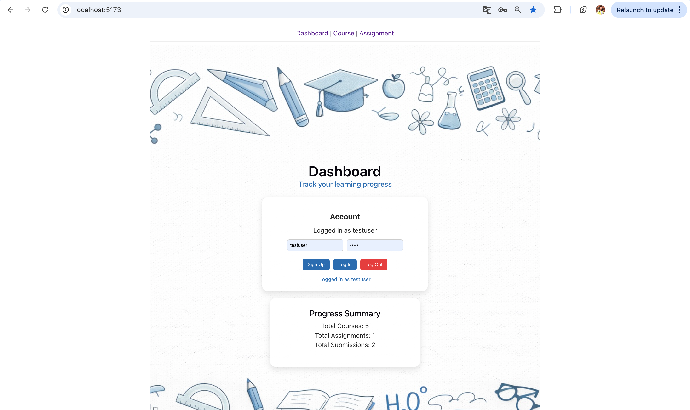
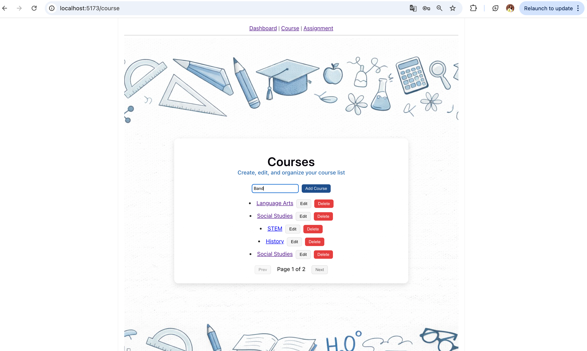
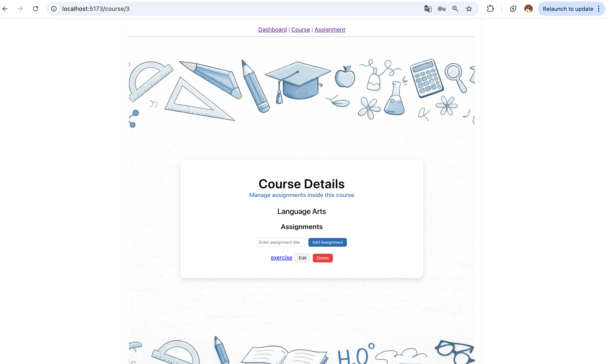
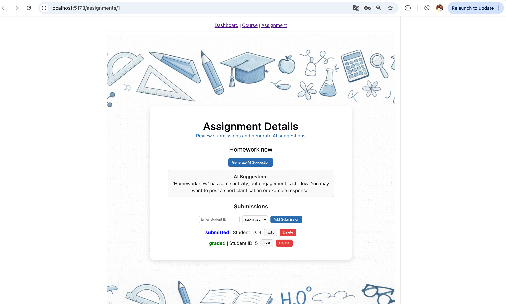

# Academic Workflow Manager

## Project Description
Academic Workflow Manager is a full-featured React application designed to help users organize academic tasks.

The application allows users to:
	•	Manage courses
	•	Create and track assignments
	•	Add and manage student submissions
	•	Generate AI-based suggestions for assignments

This project demonstrates modern React development practices including state management, asynchronous data handling, and component-based architecture.

## Technologies Used
	•	React
	•	Vite
	•	JavaScript (ES6+)
	•	CSS
	•	Vitest
	•	React Testing Library

## Installation
Clone the repository:
```bash
git clone https://github.com/N252614/academic-workflow-manager.git
```
Navigate into the project folder:
```bash
cd academic-workflow-manager
```
Install dependencies:
```bash
npm install
```

## Running the Project
Start the development server:
```bash
npm run dev
```
Open the application in your browser:
```bash
http://localhost:5173
```

## Running Tests
Run automated tests using:
```bash
npm run test
```
All tests are written using Vitest and React Testing Library.

## Features
	•	Course management (create, edit, delete)
	•	Assignment management within each course
	•	Submission tracking with status (submitted, graded, missing)
	•	AI suggestion generation for assignments
	•	Pagination for courses
	•	Clean and user-friendly interface
	•	Error handling and loading states
	•	Fully tested components

## Screenshots

### Dashboard


### Courses Page


### Course Details


### Assignment Details



## Project Structure
```bash
src/
  components/
    AlertBanner.jsx
    AssignmentForm.jsx
    AssignmentList.jsx
    ErrorMessage.jsx
    LoadingIndicator.jsx
    ProgressSummary.jsx
    SubmissionList.jsx
    SubmissionStatus.jsx

  pages/
    Dashboard.jsx
    CoursePage.jsx
    AssignmentDetailsPage.jsx

  App.jsx
  main.jsx

tests/
  Dashboard.test.jsx
  CoursePage.test.jsx
  AssignmentDetailsPage.test.jsx
  ```
  ## Testing
  	All components are tested using Vitest
	•	API calls are mocked
	•	Tests cover:
	•	Rendering UI elements
	•	User interactions
	•	Data loading behavior

## Future Improvements
	•	Backend integration with real database
	•	User authentication system
	•	Better UI/UX design
	•	Mobile responsiveness improvements
	•	Advanced filtering and search

## Author

Nataliia Katina

